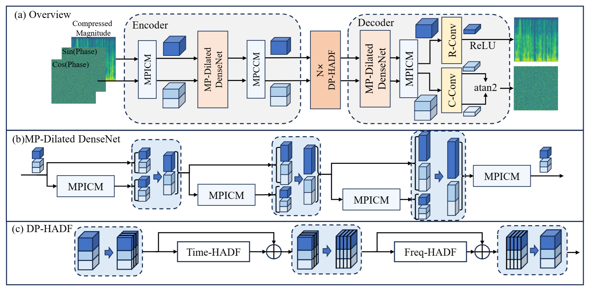
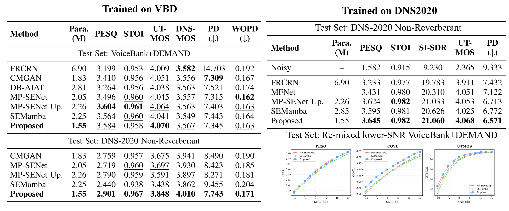
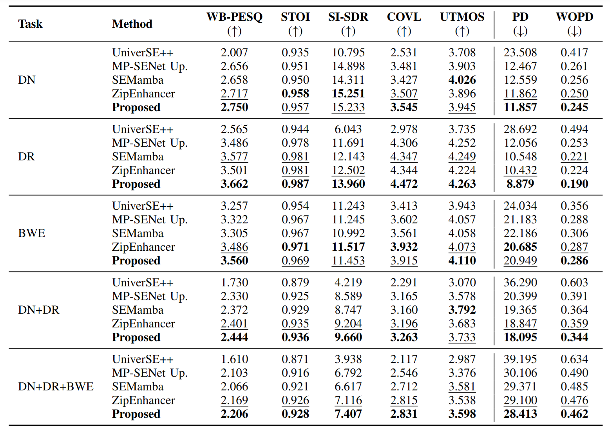

# Global Rotation Equivariance Phase Modeling for Speech Enhancement with Deep Magnitude-Phase Interaction
This repository hosts the official implementation for the paper:

**Global Rotation Equivariant Phase Modeling for Speech Enhancement with Deep Magnitude-Phase Interaction** (submitted to IEEE TASLP).

Authors: Chengzhong Wang, Andong Li, Dingding Yao and Junfeng Li*

A manifold-aware magnitude–phase dual-stream framework is proposed, that enforces **Global Rotation Equivariance (GRE)** in the phase stream, enabling robust phase modeling with strong generalization across denoising, dereverberation, bandwidth extension, and mixed distortions.

Training logs, audio samples and supplementary analysis: https://wangchengzhong.github.io/RENet-Supplementary-Materials/

---

## Implementation Summary
- **GRE as inductive bias:** explicit global rotation equivariance for phase modeling.
- **Deep Magnitude–Phase Interaction:** MPICM for cross-stream gating without breaking equivariance.
- **Hybrid Attention Dual-FFN (HADF):** attention fusion in score domain + stream-specific FFNs.
- **Strong results with compact model:** 1.55M parameters, competitive or better quality than advanced baselines across SE tasks.

---

## Method Overview

### Architecture


The model uses a dual-stream encoder–decoder with a GRE-constrained complex phase branch and a real-valued magnitude branch. Key modules:

- **MPICM (Magnitude-Phase Interactive Convolutional Module):**
    - bias-free complex convolution for phase stream
    - RMSNorm + SiLU for magnitude stream
    - cross-stream modulus-based gating preserving GRE

- **HADF (Hybrid-Attention Dual-FFN):**
    - hybrid attention with a shared score map
    - independent magnitude/phase value projections
    - GRU-based FFN for magnitude, complex-valued convolutional GLU for phase

### Global Rotation Equivariance
GRE ensures $
\mathcal{F}(\mathbf{x}e^{j\theta}) = \mathcal{F}(\mathbf{x})e^{j\theta}
$, preventing the phase stream from learning arbitrary absolute orientations while preserving relative phase structure (GD/IP).

---

## 🔵 Experiments

We evaluate on three settings:
1. **Phase Retrieval** (clean magnitude, zero phase)
2. **Denoising** (VoiceBank+DEMAND, DNS-2020)
3. **Universal SE** (DNS-2021 training, WSJ0+WHAMR! test; DN/DR/BWE/mixed)

### Phase Retrieval (VoiceBank)

| Model | Params (M) | MACs (G/s) | PESQ | SI-SDR | WOPD $\downarrow$ | PD $\downarrow$ |
| --- | ---: | ---: | ---: | ---: | ---: | ---: |
| Griffin-Lim | - | - | 4.23 | -17.07 | 0.342 | 90.07 |
| DiffPhase | 65.6 | 3330 | 4.41 | -11.75 | 0.230 | 85.66 |
| MP-SENet Up.* | 1.99 | 38.80 | 4.60 | 14.64 | 0.058 | 11.38 |
| SEMamba* | 1.88 | 38.01 | 4.59 | 13.63 | 0.059 | 12.46 |
| **Proposed (Small)** | **0.90** | **22.89** | **4.61** | **16.03** | **0.044** | **8.47** |

\* Single phase decoder for phase retrieval.

### Denoising (VBD & DNS-2020)


\* SEMamba reported w/o PCS.

Key result: strong zero-shot transfer from VBD to DNS-2020 with consistent gains across PESQ, STOI, UTMOS, and PD; SOTA results on larget-scale DNS-2020.

### Universal SE (DNS-2021 → WSJ0+WHAMR!)


Our model achieves top-tier performance across DN/DR/BWE and mixed distortions.

---

## Repository Structure
- Training:
    - train_denoising_dns.py
    - train_denoising_vbd.py
    - train_phase_retrieval.py
    - train_universal_dns.py
- Inference:
    - inference_denoising.py
    - inference_phase.py
    - inference_universal.py
- Core modules:
    - models/model.py
    - models/transformer.py
    - models/mpd_and_metricd.py
- Data:
    - dataset.py
    - dns_dataset.py
    - data_gen/
- Metrics:
    - cal_metrics_singledir.py
    - cal_metrics_hierarchicaldir.py
---

## Configurations
We provide multiple configs for different settings:
- config.json (Standard)
- config_small.json (Phase Retrieval)
- config_universal.json (Universal SE)

---

## Setup
This project depends on PyTorch and common audio/metric libraries. Make sure your environment includes:
- torch
- librosa
- soundfile
- numpy
- pesq
- pystoi
- tablib[xlsx]
- tqdm

---

## Data Preparation

### 1) VoiceBank+DEMAND (Denoising/Phase Retrieval)
Place 16 kHz wavs here:
- filelist_VBD/wavs_clean
- filelist_VBD/wavs_noisy


The Filelists are with the same formulation as that of MP-SENet:
- filelist_VBD/training.txt
- filelist_VBD/test.txt

### 2) DNS-2020 (Denoising)
Place clean wavs and noisy wavs in two separate folders and create the filelist (3000h).

Filelist format (the clean files path is set in the training script):
```
clean_fileid_118096.wav|/abs/path/to/noisy_fileid_118096.wav
```

You can generate this list using:
- data/generate_filelist.py

Default path:
- filelist_DNS20/training.txt
- filelist_DNS20/test.txt

### 3) DNS-2020 + WSJ-WHAMR test(Universal SE)
Prepare a DNS-2021-style list with the same format as DNS-2020 (300h):
```
clean_fileid_000123.wav|/abs/path/to/noisy_fileid_000123.wav
```

Default path:
- filelist_DNS21/training.txt

We provide the generated WSJ+WHAMR universal SE test set [here](https://drive.google.com/file/d/123-WvyaKZkKqbh81Q_gMTOdTGgxPB_3z/view?usp=sharing).

---

## 🚀 Training

Pre-trained checkpoints for each task are released in the `checkpoint/` folder.

### VBD Denoising
```
python train_denoising_vbd.py --config config.json
```

### DNS-2020 Denoising
```
python train_denoising_dns.py --config config.json
```

### Phase Retrieval (Small)
```
python train_phase_retrieval.py --config config_small.json
```

### Universal SE (DNS-2021)
```
python train_universal_dns.py \
    --test_noisy_dir /path/to/wsj_whamr/noisy_test \
    --test_clean_dir /path/to/wsj_whamr/clean_test \
    --config config_universal.json \
```
---

## Inference

### Unified Inference
```
python inference_{denoising|phase|universal}.py \
    --checkpoint_file /path/to/checkpoint \
    --input_noisy_wavs_dir /path/to/input_wavs \
    --output_dir /path/to/output
```

Notes:
- Use `inference_denoising.py` with a denoising checkpoint and a noisy input folder.
- Use `inference_phase.py` with PR-trained checkpoint and a clean  input folder (the script drops the phase itself).
- Use `inference_universal.py` with USE-trained checkpoint and universal degraded test input.

The inference scripts load the corresponding config file from the checkpoint folder automatically.

---

## 📈 Evaluation

Note: To evaluate UTMOS and DNSMOS, the required metric checkpoint files are not included in this repository. Please place them under `cal_metrics/dns` and `cal_metrics/UTMOS_demo` before running the evaluator.

We provide a single-directory evaluator that computes PESQ/STOI/SI-SNR/CSIG/CBAK/COVL/UTMOS/DNSMOS and phase metrics (PD/WOPD):
```
python cal_metrics_singledir.py \
    --clean_dir /path/to/clean \
    --enhanced_dir /path/to/enhanced \
    --excel_name results.xlsx
```

To compute only a subset of metrics, use `--metrics` with a comma-separated list (or `all` for everything):
```
python cal_metrics_singledir.py \
    --clean_dir /path/to/clean \
    --enhanced_dir /path/to/enhanced \
    --excel_name results.xlsx \
    --metrics PESQ,STOI,SISNR,PD,WOPD
```

For hierarchical test sets (e.g., universal subfolders), the enhanced wavs should be in the same relative structure as the clean set.

Hierarchical-directory example ( `cal_metrics_hierarchicaldir.py`):
```
python cal_metrics_hierarchicaldir.py \
        --clean_dir /path/to/clean_root \
        --enhanced_dir /path/to/enhanced_root \
        --excel_name results_hierarchical.csv \
        --metrics PESQ,STOI,SISNR,PD,WOPD
```

Target directory layout (clean and enhanced must mirror each other):
```
clean_root/
    noise_limit/|noise_reverb/|noise_reverb_limit/|only_noise/
        -5db/|0db/|5db/|10db/|15db/
            0001.wav ...
    only_reverb/
        0001.wav ...
    only_bandlimit/
        2khz/|4khz/
            0001.wav ...

enhanced_root/
  (same structure and filenames as clean_root)
```


---

## Calculating MACs
Since we use multiple custom operations, only counting standard conv/deconv/GRU/MHA underestimates MACs. We implement MAC counting for InteConvBlock(Transpose), CustomAttention, and ComplexFFN.

Run:
```
python cal_mac.py
```

To modify the model size, edit the configuration near the bottom of cal_mac.py.


## Acknowledgements
We acknowledge the contributions of the following repositories, which served as important references for our code implementation:
- [MP-SENet](https://github.com/yxlu-0102/MP-SENet)
- [SEMamba](https://github.com/RoyChao19477/SEMamba)

---

## Citation
If you find this work useful, please cite the paper.


